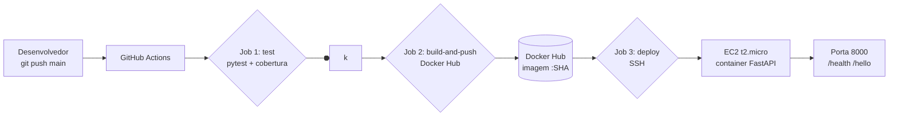
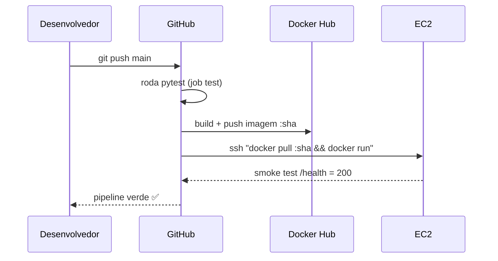

<!-- ==========================================================================
     Prova de Fogo — Pipeline CI/CD Completo
     ========================================================================== -->

<div align="center">
  <h1>🔥 Prova de Fogo</h1>
  <p><strong>Pipeline CI/CD Completo</strong></p>
  <p>Git · Docker · GitHub Actions · AWS EC2</p>

  <!-- Badges (substitua pelo seu usuário onde houver placeholder) -->
  <p>
    <a href="https://github.com/mateusrodrigues0904/prova-de-fogo-ci-cd/actions/workflows/ci-cd.yml">
      
    </a>
    <a href="https://hub.docker.com/r/mateusr0904/prova-de-fogo-fastapi">
      
    </a>
    <a href="https://licensebuttons.net/">
      
    </a>
    
    
  </p>
</div>

---

## 🚀 Sobre o projeto

Aplicação **FastAPI** mínima (endpoints `/health` e `/hello/{nome}`) servindo de
piloto para demonstrar, de ponta a ponta, as ferramentas centrais de um
**DevOps Junior**: controle de versão, containerização, integração contínua,
entrega contínua e deploy em nuvem.

Cada push na branch `main` dispara automaticamente:

```
test → build da imagem Docker → push para o Docker Hub → deploy SSH na AWS EC2
```

---

## 🏗️ Arquitetura



**Fluxo do deploy**



---

## 📁 Estrutura do repositório

```
prova-de-fogo-ci-cd/
├── app/                    # Código da API (FastAPI)
│   ├── main.py             # Endpoints /health e /hello/{nome}
│   └── config.py           # Configuração por variáveis de ambiente
├── tests/                  # Testes pytest (TestClient)
├── .github/workflows/      # Pipeline CI/CD
│   └── ci-cd.yml
├── terraform/              # Infraestrutura como código (EC2)
├── Dockerfile              # Multi-stage build (slim ~150MB)
├── docker-compose.yml      # Execução local
├── requirements.txt        # Dependências pinadas
└── pytest.ini              # Configuração de testes + cobertura
```

---

## 🧑‍💻 Como rodar localmente

### Opção A — Python direto

```bash
python -m venv .venv && source .venv/bin/activate
pip install -r requirements.txt
uvicorn app.main:app --reload --port 8000
# http://localhost:8000/health
```

### Opção B — Docker

```bash
docker compose up --build
# http://localhost:8000/health
```

### Rodando os testes

```bash
pytest
```

---

## 🔁 Como funciona o pipeline

O workflow `.github/workflows/ci-cd.yml` tem 3 jobs encadeados:

| Job | Quando | O que faz |
|---|---|---|
| `test` | todo push e PR | Instala dependências (com cache), roda `pytest` + cobertura |
| `build-and-push` | `main` (após test) | Builda a imagem e publica no Docker Hub com tag `:SHA` e `:latest` |
| `deploy` | `main` (após build) | SSH na EC2, `docker pull` da imagem exata, recria o container e faz **smoke test** em `/health` |

**Destaques de design:**
- **Tag por SHA** → cada deploy é rastreável e o rollback é um `docker run` com o SHA anterior.
- **`needs:`** → nenhum job roda sem o anterior passar (deploy nunca ocorre com teste quebrado).
- **Secrets** → todas as credenciais via GitHub Secrets (nunca no repositório).
- **Cobertura ≥ 90%** → métrica mínima definida no projeto.

### Secrets necessários

| Secret | Descrição |
|---|---|
| `DOCKERHUB_USERNAME` / `DOCKERHUB_TOKEN` | Push da imagem |
| `EC2_HOST` / `EC2_USER` / `EC2_SSH_KEY` | Deploy via SSH |

---

## ☁️ Aplicação em produção

🟢 **Rodando em:** [http://54.232.191.75:8000/health](http://54.232.191.75:8000/health)
(instância EC2 `t2.micro`, Ubuntu, free tier)

> **Nota:** o IP público da EC2 é dinâmico. Se a instância for parada, o IP
> muda — para um IP fixo, provisionar um **Elastic IP** (ver Terraform).

---

## 🛠️ Tecnologias

| Camada | Tecnologia |
|---|---|
| Linguagem | Python 3.11 |
| Framework | FastAPI (Uvicorn) |
| Testes | pytest + pytest-cov |
| Container | Docker (multi-stage, imagem slim) |
| CI/CD | GitHub Actions |
| Registry | Docker Hub |
| Cloud | AWS EC2 (Ubuntu) |
| Infra (opcional) | Terraform |

---

## 📚 Aprendizados e próximos passos

**O que este projeto me ensinou:**
- Multi-stage build e redução de imagem (de ~1GB para ~150MB).
- Encadeamento de jobs com `needs` e controle de branch no GitHub Actions.
- Deploy com secret em base64/pem e armadilhas do `appleboy/ssh-action`
  (caminho no container, permissões, newlines do PEM).
- Smoke test pós-deploy como verificação de qualidade do release.

**Próximos passos:**
- [ ] Terraform para provisionar a EC2 (Elastic IP incluído)
- [ ] Scan de vulnerabilidades com **Trivy** no pipeline
- [ ] Badge de cobertura no README (**Codecov**)
- [ ] Reverse proxy (Nginx) + HTTPS (Let's Encrypt) na porta 80
- [ ] Estratégia de rollback automatizada

---

## 📄 Licença

MIT — use, estude e adapte livremente deste projeto para o seu portfólio.